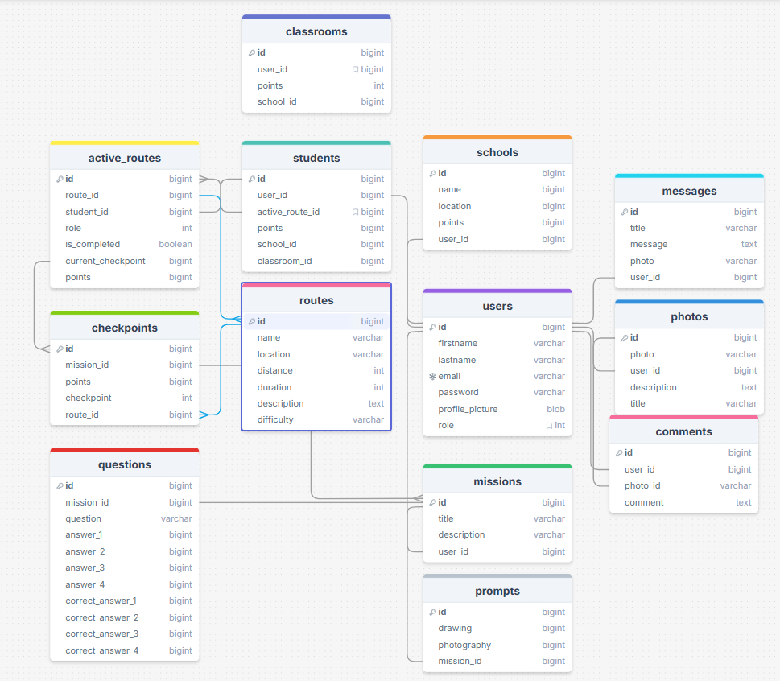

## Developer Documentation WandelWild

WandelWild is a web application designed to connect Natuurmonumenten to schools and teachers that wish to organize informative nature walks for their students as part of their curriculum. The application allows teachers to easily find local routes for nature walks, while also providing them with built-in tools to give their students tasks to do while on the route. These tasks may be themed around biology, geography, art or physical education, depending on the subject being taught. The students can answer questions, take pictures or submit artwork drawn on location to the application and have a chance to get these featured on the projectspace for their school.

## ERD

We built the application based on the following Entity Relationship Diagram (ERD):


## Installation and Deployment

To install and deploy the WandelWild application, follow these steps:
1. **Clone the Repository**: Start by cloning the repository to your local machine using Git.
   ```bash
   git clone <repository-url>
   ```
2. **Install Dependencies**: Navigate to the project directory and install the required dependencies using Composer.
   ```bash
   composer install
   ```
3. **Environment Configuration**: 

## Potential Edge Cases

These are possible issues you may encounter using the application:
- **Database Connection Issues**: Ensure that the database server is running and that the credentials in the `.env` file are correct.
- **Missing Dependencies**: If you encounter errors related to missing packages, run `composer install` again to ensure all dependencies are installed.
- **File Permissions**: Ensure that the storage and bootstrap/cache directories have the correct permissions for the web server to write to them.
    - Copy the example environment file and rename it to `.env`.
    - Ensure that the `.env` file is properly configured with database credentials and other necessary environment variables.
    - Generate an application key using the following command:
    ```bash
    php artisan key:generate
    ```
  
## Credits
Made with:
- [Laravel (PHP Framework)](https://laravel.com/)
- [Laravel Breeze](https://laravel.com/docs/11.x/starter-kits)
- [Tailwind CSS](https://tailwindcss.com/)
- [AlpineJS](https://alpinejs.dev/)
